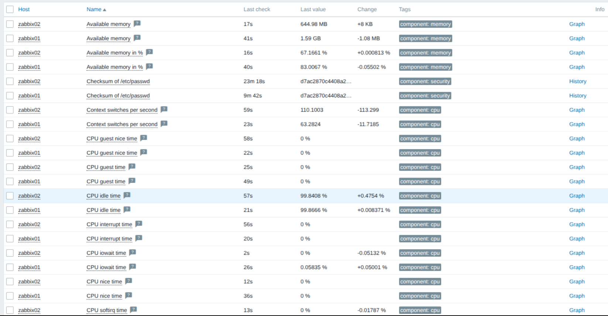

# Домашнее задание к занятию "`Система мониторинга Zabbix`" - `Сафронов Алексей`

---


### Задание 1


---


```

sudo su
apt update
apt install postgresql
wget https://repo.zabbix.com/zabbix/7.0/ubuntu/pool/main/z/zabbix-release/zabbix-release_latest_7.0+ubuntu24.04_all.deb
dpkg -i zabbix-release_latest_7.0+ubuntu24.04_all.deb
apt update
apt install zabbix-server-pgsql zabbix-frontend-php php8.3-pgsql zabbix-apache-conf zabbix-sql-scripts
sudo -u postgres createuser --pwprompt zabbix
sudo -u postgres createdb -O zabbix zabbix
zcat /usr/share/zabbix-sql-scripts/postgresql/server.sql.gz | sudo -u zabbix psql zabbix
sudo sed -i '/^#*DBPassword=/c\DBPassword=12345678' /etc/zabbix/zabbix_server.conf
sudo systemctl restart zabbix-server apache2
sudo systemctl enable zabbix-server apache2

```


----

### Задание 2

1. 
---
2. 
---
3. 


```

sudo wget https://repo.zabbix.com/zabbix/7.0/ubuntu/pool/main/z/zabbix-release/zabbix-release_latest_7.0+ubuntu24.04_all.deb
sudo dpkg -i zabbix-release_latest_7.0+ubuntu24.04_all.deb
sudo apt update
sudo apt install zabbix-agent
sudo systemctl enable zabbix-agent
sudo find / -name "zabbix_agentd.conf"
sudo sed -i '/^#*Server=/c\Server=192.168.10.8' /etc/zabbix/zabbix_agentd.conf
sudo find / -name "zabbix_agentd.log"
tail -f /var/log/zabbix/zabbix_agentd.log

```